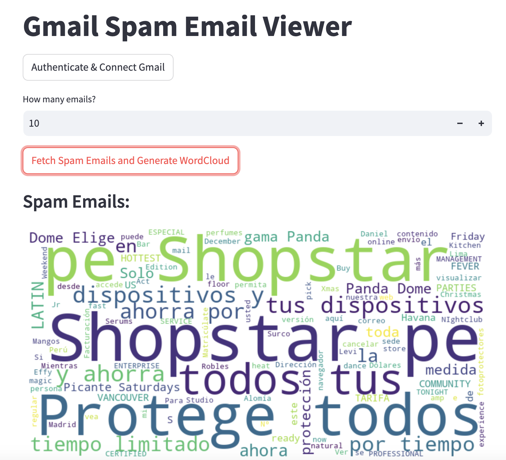
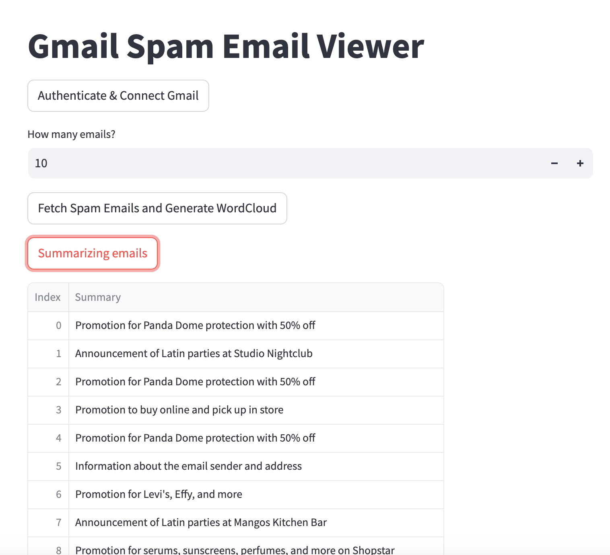

# Gmail debriefing
a Python-based tool that connects to your Gmail account, processes your emails, and generates concise summaries 

## Gmail API

Go to https://console.cloud.google.com/apis/credentials?project=...

- Create an OAuth Cliente ID. Its application type must be 'Dekstop app'.
- Name it as you wish and download as json file. e.g **"keys/desktop.json"**.

## OpenAI API
- Store your personal API in a json file within **keys folder**.

```json
{
    "openai_api_key": "..."
}
```

# Preview

The two built features are:

## Word cloud



## Summarization


